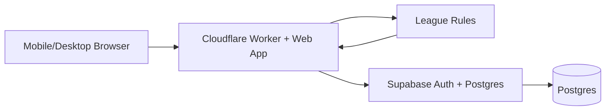

# Fremont Derby Architecture

## Goal
Keep Season 1 small, testable, and operable by one league director without manual database work.

## System shape



## Components

### Web
Mobile-first UI for public standings, player/team management, availability, lineups, scoring, and admin exceptions.

### League rules
Pure functions with no UI or database dependencies. Scheduling, Fargo race targets, 8/9 match state, standings, qualification, and playoff seeding live here. These rules are tested before UI work.

### Trusted server commands
Cloudflare Worker endpoints own privileged transitions: publish season, finalize/correct a match, approve admin exceptions, lock rosters, generate playoffs, and change payout configuration.

### Data and identity
Supabase provides Postgres, authentication, and Row Level Security. Browser access is limited by RLS; service-role credentials stay server-side only.

## Environments
- **Local:** local app/tests; no production credentials.
- **Staging:** separate Supabase project/data and separate Worker hostname.
- **Production:** `fremontderby.com`, production Worker, production Supabase project.

Staging and production must never share database credentials.

## Repository layout

```text
src/                 Cloudflare Worker / web entrypoint
domain/              pure league rules
test/                unit/integration tests
docs/                architecture and ADRs
supabase/migrations/  versioned database migrations (when introduced)
.github/workflows/    CI/CD
```

## State ownership
- Historical results are appendable/auditable, not silently overwritten.
- A player identity persists across teams, substitute appearances, and trades.
- Season configuration versions race rules and qualification rules so historical seasons can be reproduced.
- Normal operations must have a supported UI/API path; direct production row edits are exceptional recovery only.

## Trusted vs direct operations

Safe public reads and narrowly scoped user-owned writes may go directly to Supabase under RLS. Privileged or multi-row state transitions go through the Worker.

| Operation | Boundary |
|---|---|
| View schedule/standings | public read |
| Update own availability | authenticated + RLS |
| Captain roster/lineup actions | authenticated + RLS / validated command |
| Publish season | trusted Worker command |
| Finalize/correct match | trusted Worker command |
| Generate playoffs | trusted Worker command |
| Change payout configuration | trusted Worker command |

## Engineering principles
1. Tests define league behavior before UI.
2. Domain rules do not depend on React, Cloudflare, or Postgres.
3. Every schema change is a committed migration.
4. Authorization is enforced at the data boundary, not only in the UI.
5. Keep one app and one database until real scale requires otherwise.
