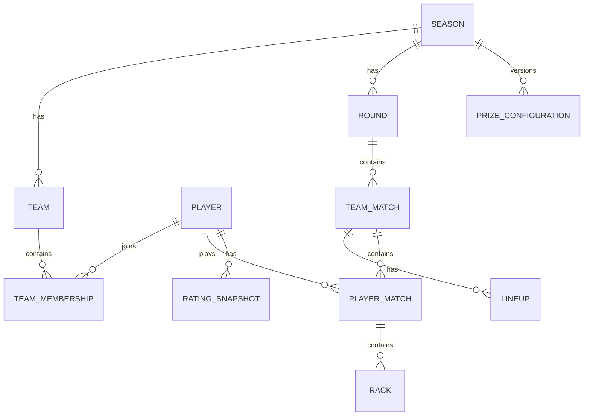

# Season 1 Data Model

## Design goals
- Preserve history when players substitute, trade, or leave teams.
- Reproduce every finalized race from stored ratings, rules, and rack history.
- Derive standings from source results rather than manually maintained totals.
- Keep payment visibility separate from public prize-pool visibility.

## Core entities

### Identity and players
- **users** — Supabase auth identity.
- **players** — public league identity, display name, Fargo reference/status.
- **season_players** — participation in a specific season and eligibility state.

### Teams and roster history
- **teams** — team identity within a season.
- **team_memberships** — player/team relationship with `starts_at` and `ends_at`; captain role belongs here.
- **free_agent_availability** — player availability for specific rounds without permanent roster membership.
- **trades** — proposed/accepted/approved roster movement and audit state.

### Season and schedule
- **seasons** — dates, status, configuration/version references.
- **rounds** — seven regular-season rounds plus postseason rounds.
- **team_matches** — two teams paired in one round/table assignment.
- **lineups** — submitted lineup slots and whether each slot is rostered, substitute, or forfeit.

### Ratings and competition
- **rating_snapshots** — immutable rating used for a player in a round/match.
- **race_chart_versions** — versioned rating-gap-to-race configuration.
- **player_matches** — two players, team-match context, race targets, opening choice, status, winner.
- **racks** — ordered rack result with discipline and winner.

### Money and audit
- **prize_configurations** — entry fee, administration share, team pool, individual pool, payout version.
- **payment_status** — private player payment state.
- **audit_events** — actor, action, entity, timestamp, reason, before/after metadata for privileged changes.

## Important relationships

## History rules
1. A trade closes/starts memberships; it never rewrites old memberships.
2. A substitute appearance belongs to the player and the team used for that round only.
3. A missed round creates no `player_match` and therefore no individual win/loss.
4. A finalized `player_match` stores the rating snapshots, race-chart version, race targets, and rack sequence used at the time.
5. Correcting a finalized result creates an audit event and preserves recoverable prior state.
6. Team and individual standings are derived from finalized matches.

## Migration strategy
- Schema changes live in `supabase/migrations/`.
- CI starts from an empty database and applies every migration in order.
- Seed/fixture data is separate from migrations.
- Destructive migrations require an explicit recovery/rollback note.
- Production schema is never changed manually as the normal workflow.

## Initial implementation order
1. seasons / players / season_players
2. teams / team_memberships
3. rounds / team_matches / lineups
4. rating_snapshots / race_chart_versions / player_matches / racks
5. free agents / trades
6. prizes / payments / audit events
